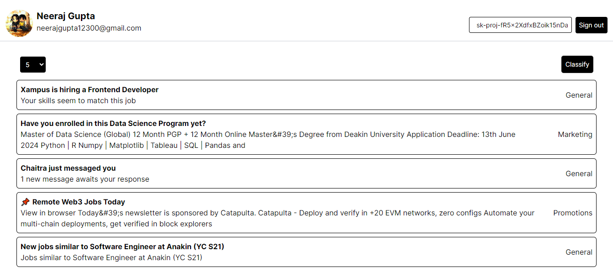

# About this project

This is a Next.js project and it uses all the best practises and industry standards of writing code. It is an assignment project for Slides AI that contains google authentication, gmail API integration, openai API integration. It basically fetches emails from your inbox and classifies them into various categories.

The key things achieved by me through this project were -

- NextAuth (Google OAuth using GCP)
- Gmail API integration
- OpenAI API integration

# For running this project follow the below steps

Step 1 - Goto your desired file location and open terminal.

Step 2 - Clone the project here by using the following command

git clone https://github.com/Whycodex/SlidesAIAssignment.git

Step 3 - Now change directory from the terminal using the following command

cd SlidesAIAssignment/

Step 4 - Open this folder inside a code editor of your choice by using the following command (you can use vs code for it’s extensive features) and make sure to be inside the SidesAIAssignment folder

code .

Step 5 - Create a .env file in the root directory and copy the content from .env.example file. Now put in your secrets here. Get Google Client ID and Google Client Secret from Google Cloud Platform and you can use the same NEXTAUTH_SECRET and NEXTAUTH_URL

Step 6 - Now open the terminal and install all the dependencies by using

npm install

Step 7 - After installing all the dependencies, simply run the following command

npm run dev

# Screenshots

# Deployed link to the app
https://whycodex-slides-ai.vercel.app/